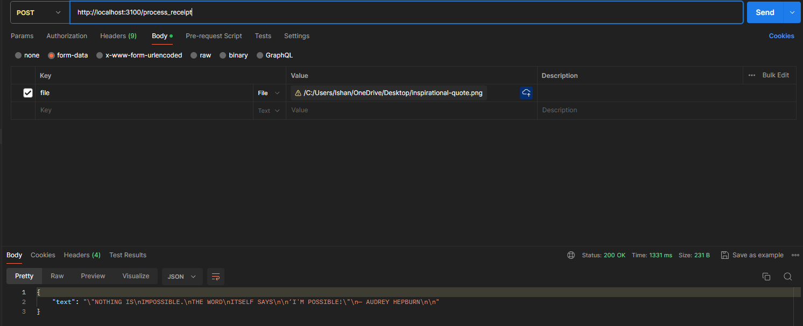

# Local Testing on Docker [1st way]

`docker build --tag fastapi-ocr-intelli .`

`docker run --detach --publish 3100:3100 fastapi-ocr-intelli`

# Local Testing without Docker [2nd way]

###  Install the requirements

apt-get install -y tesseract-ocr && apt-get install -y libgl1-mesa-glx

`pip install -r requirements.txt`

### Start the application

`uvicorn main:app --reload`
OR
`gunicorn main:app -c gunicorn.conf.py`
## Example call to access the application on:

### browser:

http://localhost:3100/

### curl:

curl -X POST -H "Content-Type: multipart/form-data" -F "file=@/path/to/image.png[/jpeg/jpg]" http://localhost:3100/process_receipt

### postman:

